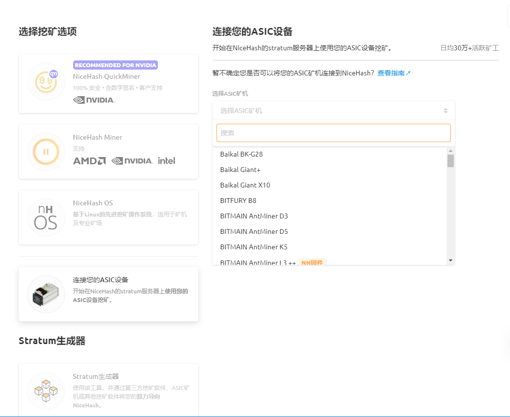
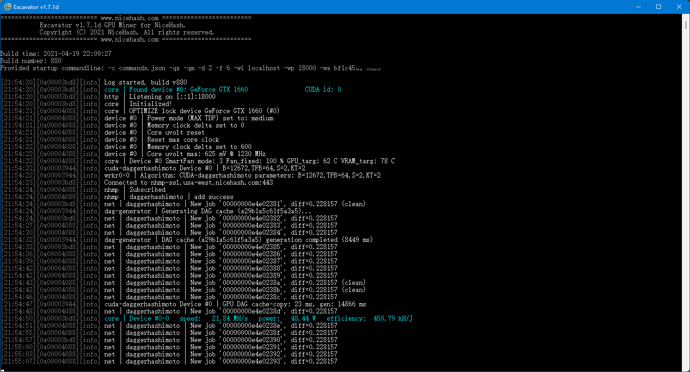

# 比特币与区块链

区块链已经从当年技术人群的小众玩物变成了一种大众软件，现在只要是一台高配的个人电脑就可以在玩耍的同时轻松开启“挖矿”工作，人人矿工的时代或许真的来了！加上近期【比特币】（下文简称BTC）的行情波动，chia币的热炒，连带着显卡和硬盘在电商平台上都出现价格暴涨和脱销的现象，更多的人开始关注这个新领域的动态了。


我也凑个热闹，用最简单的办法让每个人体验一次数字货币的魅力吧。

## 比特币的渊源

早期的BTC设计的非常简单,就是大家每个参与者都用一个数字钱包参与记账就好,BTC只是做为记账的奖励而存在的,为什么记账会有奖励呢?因为随着参与的人越来越多,财的条目自然也就会越来越大,而作为分布式网络金融应用,必然要求足够的时效,所有的钱包在早期大家都是在本机直接构建的,也就是所有的条目都在电脑中,可以想像有多大了,我记得在09年我的破电脑就要下载大约6G的钱包条目之后才能参与,今天看起来这个非常小case啦,然而我当时的电脑只有一共80G的总存储,那时候500G在我看来就是一个非常巨大的空间了!哪像现在一个手游都是轻松10G的占用呢....

扯远了,钱包下载完成后就会通过网络参与BTC的记账,就会有机会去拿到数个BTC,所以早期参与者们对BTC并没有认识到价值,以至于发生了拿1000多个BTC去买了两块披萨的经典故事,很多人说那个程序员肯定后悔死了,因为1000多个BTC按着当前的市价是可以买两架私人飞机的了.但事情不能总是从上帝视角去看,毕竟我们不可能成为上帝,事后的诸葛亮在我们这边也太多了点.其实在我看来,那位披萨程序员才是真正让BTC发挥价值的创新者,他的价值不亚于中本聪的初代设计.因为他的行为代表了数字货币正式进入了人们的日常生活,而这也是BTC价值真正表现的开始.

## 比特币的发展与延伸

在这之后,BTC的价值就一直在不断上升了,因为几乎所有人都认识到了这种新型价值工具意义不再仅限与黑客们的暗网交流,虽然暗网交流至今仍然是数字货币的最大存储池,但现实世界已经慢慢认可了这种脱离政府与银行设计的新型工具,前阵子连地球上最聪明的马斯克也开始提出了一个BTC换一台特斯拉的美国营销活动.这也意味着数字货币已经真正进入了人类的生活.而这也就是民众对金融霸权的最简单反抗.所以随着被认可,BTC就产生了大量的衍生品与复制者,ETH,CHIA甚至恶搞的狗狗币都成功上位成为人们追逐的未来货币,在这个过程中,人们也慢慢理解了这种分布式的记账原理,区块链也正式成为公众话题.

BTC的设计之初只是为了让大家更好的记账而不被中心服务器修改,所以设计了一种记账机制就是看谁先算出一个非常难的数学题,谁就得到一个BTC,然而只要有规则就必然有作弊这一条人类的共性让黑客们先想到,我拿更快的CPU是不是就更容易先算出来呢?再接着黑客们就想到了显卡的GPU可是比CPU快N倍的东西,拿GPU算是不是更快呢?于是显卡就进入了这种计算能力的大比赛中,也就是现在的算力之争.然后技术的进步让多块显卡并行计算得到了更好的应用,也就出现了所谓的矿机,在一块特制的主板上,最少能同时用6~8块显卡进行计算,这样的算力在早期甚至可以做到一天就有一个BTC的效果,所以真正的大玩家们手上的BTC可不是一点点的哟.然后就是各种衍生币们把计算的焦点做了一些调整,一方面是突出自己的特色,另一方面也是为了更好的写白皮书向VC们要抽奖,比如最近火爆的起亚币\[chia\]就是拿硬盘空间做为算力标准,这直接导致了电商平台所有硬盘涨价或断货.....而chia币的发起人是著名的BT软件设计者,这个身份让这个新币种即使目前还没上交易所就被关注度引爆,毕竟BT软件也是一个划时代的工具呀,而这位大神很明显对硬盘有种某种情怀....当年的BT就是有硬盘杀手称号的,这次数字币还是个硬盘大杀器呀....

相信大家看到这应该明白了,数字货币就是用某种计算方法把电脑硬件做的一种全球化计算工具,或者用CPU资源,或者用显卡资源,或者用硬盘存储资源,甚至还有一种新出现的PI币是用手机资源,当我们把这些资源用一种计算工具与算法进行网络交换后,我们通常都会得到一定数量的数字货币,而如何保存和使用这些数字货币就是一件充满想像力的事情了.

## 比特币矿场的出现

随着技术的进步与发展,BTC也不再是像早期那样,上来就要你下载一份钱包备份,开始出现了一种矿场模式,以前挖矿的都是每个黑客自已搞自己的,每个黑客自己都有一份完整的钱包镜像,现在这个钱包数据有多大我已经没有考证过了,,,,因为现在参与BTC只要从世界代码大全的github中下载一个开源软件就可以了,已经不再那么麻烦了,要知道,早期的BTC钱包配置就可以让大家折腾几天,因为09年的时代网络不过10M左右,要从网上下载一个完整的6G钱包数据也是一件麻烦事呀!

现在有很多矿场把钱包这一步帮你解决了,因为网速已经够快了,我们与矿场交互起来也不再那么困难了,只要在对应的矿场中注册一个帐号,矿场就会给你生成一个钱包,而你的挖矿软件也只要从其矿池中进行相应的计算就可以了,大家不再像早期那样不断计算只为得到一个必得的BTC,虽然奖励很诱人,可是要知道,早期的计算如果不能按时完成是啥也得不到了,所以才会有人一天得到一个甚至几个BTC,有人开机一个月也拿不到一个\[比如我....我当时的电脑性能可谓是极渣的根本无法及时完成任何一次计算,所以我也就只好最后放弃了,加上当时遇到婊子坑爹,也没啥心情研究下去\]

现代的挖矿软件更像是一种分包服务,把你的计算资源交到矿场参与矿池挖掘,然后根据你的资源大小来分成所得的BTC或其他币,这就保证了只要有一定的计算资源都会得到一定的奖励.按我目前使用的N卡1660来算,大约一天可以收入12元,而成本就是显卡和电费,我国民用电的电价还是比较便宜的,至少目前来看还是比较划算的.而更高级的显卡就会带来更高的收入,同时也会消费更的电力.昨晚到一个很久没去的网吧小看了一眼,现在网吧都在用N卡的2770了,这可是比我的显卡还要高阶的呢,不过网吧采用的是win7系统,而且屏蔽了github的访问,无法直接从官网下载挖矿工具的.所以我就把相应的工具都下载好放在了自己的NAS中,这样大家可以更快速的使用工具来做一下挖矿体验,了解数字货币的产生流程也是一件很有意思的事情哟:

## NiceHash的软件介绍与下载

我以当前最热门的矿场nicehash为例,他们家提供了三种快速挖矿软件:



NiceHash QuickMiner 目前最推荐的,不过只支持win10了.并且只限nvdia的显卡可用.

NiceHash Miner 支持大部分的主流显卡,也支持较早的windows版本.

NiceHash OS 独立专用系统,下载镜像后写入U盘,整个机器就变成了专用矿机

同时这家矿场还提供了在NiceHash的stratum服务器上使用您的ASIC设备挖矿的方法,ASIC设备是一种专用设备,目前我还没有资金购买这种设备测试,就不多说这个了.还有一种Stratum生成器,可以直接通过第三方挖矿软件、ASIC矿机或其他挖矿软件将算力导向NiceHash,当然,这也是较高阶的玩法了.

QuickMiner的下载地址: [https://nas.aqde.net:9090/fbsharing/qQHZZr9V](https://nas.aqde.net:9090/fbsharing/qQHZZr9V)

Miner的下载地址: [https://nas.aqde.net:9090/fbsharing/OH3jjkp5](https://nas.aqde.net:9090/fbsharing/OH3jjkp5)

好了,相应的软件工具我都提供了镜像下载,,如果你愿意安装尝试的话,欢迎自行选择体验,,不过要提醒的是,挖矿的显卡目前的建议是要有4G以上的显存才可以,较低的显存是无法被软件正常识别支持的.软件安装后第一次启动是需要输入钱包地址的,您可以使用我提供的地址先做一下测试体验:

```text
    3Ntgr2pMam4bvg9PEnm4PTkD2ad1FAzLuX
```

## 体验计算机性能

其实在我一个普通人看来，比特币更多的来说是一种数字信仰，因为早期真正通过比特币赚到钱的人早都已经上岸了，今天再进入这个数字货币市场已经跟金融股票是一样的玩法了，如果自己电脑是新配置的，倒是可以用相应的软件来测试一下性能，比如我的破主机：


## 原版的全节点
最好的办法当然是使用原版的bitcoin core来运行一个全节点，官方的教程[在这里](https://bitcoin.org/en/full-node#linux-instructions) 我的[镜像下载](https://nas.aqde.net:9090/fbsharing/nCLK2cJf)

不过要运行这个功能对机器和网络的要求都非常的高，至少我的电脑一直都无法完成全节点，因为总数据量现在【2021-07】已经超过了360G，而且要不断更新最新交易，所以网络也要够快。

也可以通过控制台加入node来提高速度，使用google可以找到不少的node整理，比如这个：https://bitnodes.io/ 这里还以[查看比特币网络的最新状态](https://bitnodes.io/dashboard/bitcoind/)

找到合适的节点后用

        addnode 159.89.42.205 add

这样的命令加进节点就可以提高速度了。

### centos8安装节点程序的执行结果

[root@hypevCentos8 ~]# curl https://bitnodes.io/install-full-node.sh | sh


  % Total    % Received % Xferd  Average Speed   Time    Time     Time  Current
                                 Dload  Upload   Total   Spent    Left  Speed
100 19624    0 19624    0     0   6813      0 --:--:--  0:00:02 --:--:--  6811
Start date: Sat Jul 24 16:49:35 CST 2021

Welcome!

You are about to install a Bitcoin full node based on Bitcoin Core v0.21.1.

All files will be installed under /root/bitcoin-core directory.

Your node will be configured to accept incoming connections from other nodes in
the Bitcoin network by using uPnP feature on your router.

For security reason, wallet functionality is not enabled by default.

After the installation, it may take several hours for your node to download a
full copy of the blockchain.

If you wish to uninstall Bitcoin Core later, you can download this script and
run "sh install-full-node.sh -u".

Starting installation in 10 seconds..

Creating target directory: /root/bitcoin-core

Downloading Bitcoin Core binaries..
Checksum passed: bitcoin-0.21.1.tar.gz (366eb44a7a0aa5bd342deea215ec19a184a11f2c                                                         a22220304ebb20b9c8917e2b)
Signature passed: Signed checksum.asc verified successfully!

Installing Bitcoin Core v0.21.1
Bitcoin Core v0.21.1 (binaries) installed successfully!

Starting Bitcoin Core..
Bitcoin Core starting
Bitcoin Core is running!

Checking Bitcoin Core..
{
  "version": 210100,
  "subversion": "/Satoshi:0.21.1/",
  "protocolversion": 70016,
  "localservices": "0000000000000409",
  "localservicesnames": [
    "NETWORK",
    "WITNESS",
    "NETWORK_LIMITED"
  ],
  "localrelay": true,
  "timeoffset": 0,
  "networkactive": true,
  "connections": 1,
  "connections_in": 0,
  "connections_out": 1,
  "networks": [
    {
      "name": "ipv4",
      "limited": false,
      "reachable": true,
      "proxy": "",
      "proxy_randomize_credentials": false
    },
    {
      "name": "ipv6",
      "limited": false,
      "reachable": true,
      "proxy": "",
      "proxy_randomize_credentials": false
    },
    {
      "name": "onion",
      "limited": true,
      "reachable": false,
      "proxy": "",
      "proxy_randomize_credentials": false
    }
  ],
  "relayfee": 0.00001000,
  "incrementalfee": 0.00001000,
  "localaddresses": [
  ],
  "warnings": ""
}


Bitcoin Core is not accepting incoming connections at port 8333. You may need to                                                          configure port forwarding (https://bitcoin.org/en/full-node#port-forwarding) on                                                          your router.

#### README

To stop Bitcoin Core:

    cd /root/bitcoin-core/bin && ./stop.sh

To start Bitcoin Core again:

    cd /root/bitcoin-core/bin && ./start.sh

To use bitcoin-cli program:

    cd /root/bitcoin-core/bin && ./bitcoin-cli -conf=/root/bitcoin-core/.bitcoin                                                         /bitcoin.conf getnetworkinfo

To view Bitcoin Core log file:

    tail -f /root/bitcoin-core/.bitcoin/debug.log

To uninstall Bitcoin Core:

    ./install-full-node.sh -u

If this your first install, Bitcoin Core may take several hours to download a fu                                                         ll copy of the blockchain.

Installation completed!

End date: Sat Jul 24 16:52:52 CST 2021


## 一些有趣的btc相关网站
似乎是个人版的BTC网络分析：https://bitcoincharts.com/bitcoin/

BTC官方的挖矿教程：https://www.bitcoinmining.com/getting-started/ [中文版](https://www.bitcoinmining.com/translations/getting-started/zh-getting-started/)

Payeer在线钱包：https://payeer.com/en/account/ 「转移时有0.5%的手续费」 同时提供[数字币汇率行情](https://payeer.com/en/account/trade/) 、 [注册后即可使用](https://payeer.com/018753697) ，服务器位于捷克境内，受欧州数据保护，隐私性较好。

BCH，一个重点放在交易功能的基础网站：https://bitcoinfees.cash/

一个不用注册的临时钱包：https://sideshift.ai/ 打开网页即可使用钱包，密钥是通过浏览器保存的一串字符，可在其他浏览器恢复，同样收0.5%的手续费。

CoinEx交易所，值得信赖的数字资产交易平台，聚集创新数字资产。[点此注册](https://www.coinex.com/register?refer_code=t6783) 上面的两个功能似乎都与这个交易所有关。安全性应该还是有保障的。

## 区块链并不是只有比特币

区块链是一种分布式的计算与加密技术，比特币只是第一个验证并实现这项技术的数字货币应用，相应的还有很多基于区块链的数字货币，有一些跟比特币类似，发布公链，全网实现统一技术，数据统一公平，可靠性较高，如ETH； 另一些则基于区块链发布私有链，看上去与比特币很像，但完全是一种内部控制，并不可信。

### ETH的一些相关网站：

1、ETH的公链分析：https://etherscan.io/charts

2、ETH的钱包：https://metamask.io/download.html


## 我的钱包信息

### bitcoin-core生成的钱包
URI：

        bitcoin:BC1Q2FWT6KYM2MFDNAYY9RC3PQDU3FG0XKC2X2NKVM?label=powerPC&message=thanks%20for%20your%20gift.


直接地址：

        bc1q2fwt6kym2mfdnayy9rc3pqdu3fg0xkc2x2nkvm

二维码：


## 居家挖矿的能耗计算

我在用一台1660的显卡做挖矿的测试，结合小米的插座电力计算功能与安徽本地的居民电价做一个粗计算，由于电脑中还在用四块硬盘跑一个文件服务器，24小时开机，偶尔还会停止挖矿打一打坦克世界的游戏，所以结果仅供参考。

成本：每周18度电，每年即18*52=936度电。按不分时的第一档电价计算为一年529.12元。

收益：根据NiceHash软件的显示，这个显示的算力在21~23MH/S之间，一年这台电脑的挖到BTC大约为0.01~0.02之间。



综上所述，只要BTC价格不跌破¥53000【$7500】，基本在家挖矿的收支就平衡了。

如果是多台电脑或专业矿机挖矿就要考虑电价的分档问题了，目前安徽的电价分为三档：

一档（年用电量2160度以内），价格0.5653；

二档（年用电量2161-4200度），价格0.6153【每度涨5分，约10%】；

三档（年用电量4200度以上），价格0.8653【每度涨2角5分，约50%】

