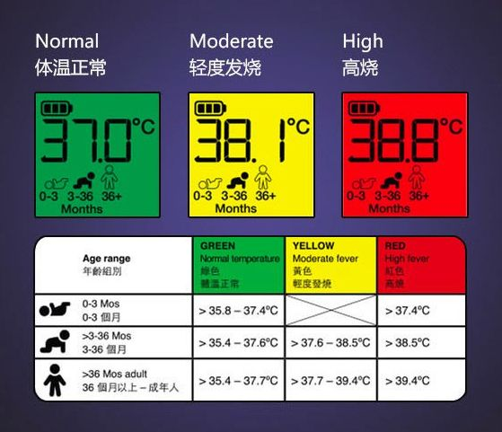

# 如何正确的测量体温

新型冠状病毒感染的肺炎疫情爆发以来及时监测自己的体温变化，高度警惕发热毫无疑问是最重要的防范措施之一！！！

但就是这样一件小事，很多人却没做对。

我发热了吗？

这几天，测体温成了大家最关心的话题。进小区、进地铁、进单位、甚至进食堂，都得滴一下！

然而许多人都有这样的疑虑：自己体温是不是高了？37.3℃是不是发热了？因为大家都害怕发热。

比如有人遇到了这种情况，很是搞不懂？早上出门前在家，自己用耳温枪测了是37.4℃，到了单位额头测出来是36.8℃。于是很害怕：我这是发热吗？还是出了什么问题？

体温，看起来简单，其实并不是，测的方法有很多，设备有很多，是不是发热还真不是只靠一个数字决定的。

今天，带大家正确的来量体温！

## 测体温的设备

体温，是我们人体内部的温度，用手可能感受个大概，额头碰额头也是我们常用的方法，但是真正知道体温多少，还是需要借助设备：

###（1）水银体温计：
非常经典的测量工具，通过看水银上升的数字来知道体温是多少。

优点：价格便宜，体积小巧，操作方便，准确、稳定。

缺点：有交叉感染风险，测量时间长，汞有毒，易破碎。

###（2）电子体温计：
水银体温计2.0版，使用方法和水银的相似，从显示在屏幕上的数字知道体温。

优点：贵一点，使用方便，测量时间短，安全性高，读数方便。

缺点：需要校准，不如水银体温计准，一样有交叉感染风险。

###（3）耳温枪：
潮流产品，通过在鼓膜附近测量温度，告诉你人体内部的温度是多少。

优点：测量时间短、读数方便。

缺点：价格比较贵，如果操作不正确会有误差，比如没对准、有耳shi。

###（4）额温枪：
筛查神器，测量的是额头的温度，不直接接触皮肤。

优点：读数快，没有交叉感染风险。

缺点：结果容易受外界因素干扰，比如室外温度、光线、辐射等，所以不太准，还有就是价格较高。

## 超过多少是发热

尽管每次测出来的是一个数字，但实际上我们的实际体温是个范围，一般来说超过这个范围是发热，但也有例外。

###（1）水银/电子体温计：
这两个类似，主要有3种测量方法，3种的正常范围都不一样。

#### 嘴巴里面量：
放在舌下，闭嘴约3分钟后取出，正常范围为36.3℃--37.2℃，一般超过37.2℃是发热；

#### 腋窝里面量：
夹在腋窝，夹紧5分钟后读取数值，正常范围为36.1℃--37℃，比口腔温度约低0.2℃--0.4℃，一般超过37℃是发热；

#### 肛门里面量：
小孩子用的多，插入肛门，3分钟后取出，比口腔温度约高0.3℃--0.5℃；一般超过37.5℃是发热。

###（2）耳温枪：
不同年龄，正常范围是不一样的（如下图），总的来说，对于3岁以上的成人，一般超过37.7℃是发热。

###（3）额温枪：
不同年龄，正常范围是不一样的（如下图），而且波动比较大，对于大部分来说（11岁-65岁），超过37.6℃是发热。

尽管看起来很简单，对照这个数字就可以了。但体温的复杂在于，有时候会有例外，这个数字只能是个参考：

### 性别：
女生一般比男生高点，在月经前、怀孕早期体温会轻度增高，而排卵期会轻度降低（似乎你懂了点什么）；

### 年龄：
一般幼儿偏高点，老人偏低点；

### 昼夜：
一般早上2-5点最低，下午5-7点最高，“夜猫子”夜里的体温会高点；

### 其他：
比如情绪激动、运动以后体温会增高，吃完东西、外面温度变化，测出来的温度也会有变化。

虽然，只是个参考，但一个准确的数字还是很重要。

那么，怎么测量才更准呢？

## 怎么测体温更准

我们都希望能快速地、准备地知道自己的体温是多少，那么事实是什么样的呢？

### 设备方面：

一般来说，从测量设备上来排名：水银温度计>电子温度计/耳温枪>额温枪

额温枪用来做发热筛查还是一种很好的办法，毕竟速度快，没有交叉感染。但要确定是不是真的高，还是要靠其他三种方法，水银温度计作为一种经典方法，还是挺靠谱的。

### 方法方面：

工具选对了，就准了吗？不是，测量的方法更重要，使用不当肯定不准：

（1）水银体温计甩表的时候一定要注意不能甩到东西，以防撞击碰碎体温计，甩至35度以下即可；

（2）口腔测温30分钟前不能吃任何食物、吸烟或者喝水，防止结果不准确；

（3）使用耳温枪或者额头枪时要注意热水澡30分钟不能使用后，热水澡会使头脑发热，测量出来的结果不准确；

还有，如果是高了那么一丢丢（0.1、0.2），也不一定是真的高，因为仪器只是个仪器，我们总允许它有点点误差。

所以测一次就能完全成功，看来是不可能的，多测几次很重要。

## 正确的方法是：

如果你没有不舒服、体温正常，那就行了；

如果你没有不舒服，体温高了，多测几次；

如果你有了不舒服，体温正常，多测几次。

### 时间可以是：

早上8点左右、下午3点左右、晚上8点左右。

最重要，首先看你有没有不舒服。

当然这个不舒服不是吓出来的

## 总结一下

体温

它只是个参考数值，

影响它的因素有很多

平时我们也不是很重视它，

但是，现在我们还是要记住一些东西：

### 水银温度计>电子温度计/耳温枪>额温枪

### 口温：37.2℃、腋温：37℃、肛温：37.5℃

### 耳温：37.7℃、额温：37.6℃

数字只是参考

没有不舒服

多测几次！
