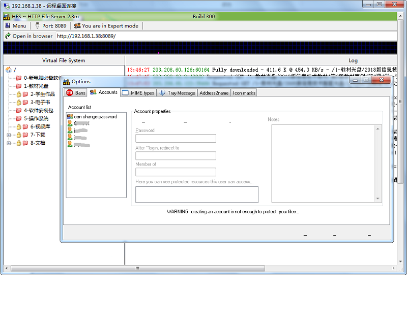

# NAS方案对比

## NAS功能
NAS（Network Attached Storage：网络附属存储）按字面简单说就是连接在网络上，具备资料存储功能的装置，因此也称为“网络存储器”。

## 常用方案
- NAS专用设备（一次性购买）
- Linux模拟 （无需购买）
- windows模拟（无需购买）
- 云盘实现 （按年付费购买）

## 专用设备
群晖：https://item.jd.com/5875816.html 1980元一台
设备另需购买2块硬盘 https://item.jd.com/675971.html 299元一块1T的

### 优点
后期无需管理与维护，速度稳定，无需专线（有公网IP）的网络
快速支持windows,linux,安卓,苹果各类终端接入。

### 缺点
价格较高，如果需要文件永久无损，需要更高配置的设备，如：https://item.jd.com/7765739.html 价格要再提高三倍

## Linux模拟
通过安装Linux下的相应软件实现

### 优点
开源软件，无任何版权问题，可选方案也较多。

### 缺点
需要一台电脑长期保持开机，并且需要专线接入的网络。
需要专业人员设置与维护。
仅支持电脑快速接入，手机接入较困难

## windows电脑模拟
通过FTP软件或HFS这样的工具实现。

### 优点
无需另行投资，软件安装配置完成后即可使用。

### 缺点
需要一台电脑长期保持开机，并且需要专线接入的网络。
软件与电脑系统需要进行配置与维护。
仅支持电脑快速接入，手机接入较困难

## 云盘实现
可通过阿里云或百度网盘实现

### 阿里云
需要专业人员设置与维护。按年付费购买

### 百度类网盘
购买并下载APP使用，按年付费购买
