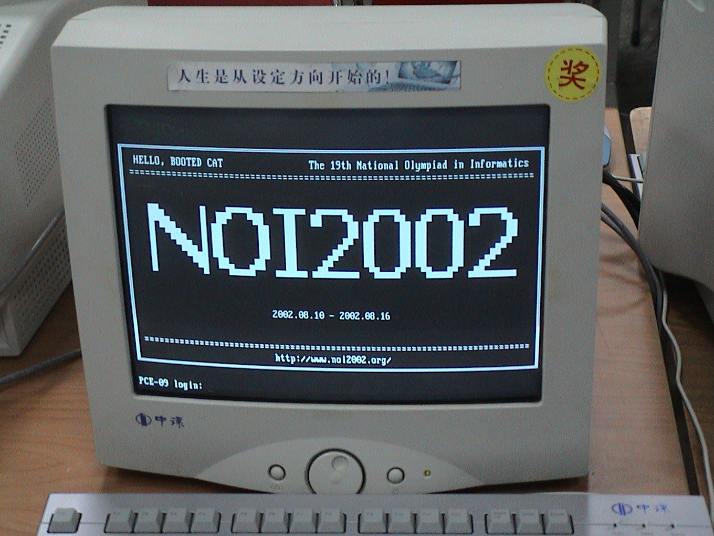

# NOI-竞赛简介

{{About|全国青少年信息学奥林匹克'''竞赛'''（NOI）|同为[[中国计算机学会]]主办的省级的信息学竞赛|全国青少年信息学奥林匹克联赛}}

'''全国青少年信息学奥林匹克竞赛'''（'''N'''ational '''O'''lympiad in '''I'''nformatics，'''NOI'''），是由[[中华人民共和国教育部]]和[[中国科学技术协会]]批准的，[[中国计算机学会]]主办的主要面向[[中华人民共和国]]全国中学生的每年一度的[[信息学]]（计算机）学科奥林匹克竞赛。第一届竞赛于1984年举行，当时名称为'''全国中学生计算机程序设计竞赛。'''自1989年起，改名为全国信息学奥林匹克竞赛。

## 概述

全国青少年信息学奥林匹克竞赛是国内包括港澳在内的省级代表队最高水平的大赛，自1984年至今，在国内包括香港、澳门组织竞赛活动。每年经各省选拔产生5名选手（其中一名是女选手），由中国计算机学会在计算机普及较好的城市组织进行比赛。这一竞赛记个人成绩，同时记团体总分。<ref>{{Cite web |url= http://www.noi.cn/about/summary |title= 全国青少年信息学奥林匹克竞赛系列活动简介 |quote= NOI：全国青少年信息学奥林匹克（NOI）是国内包括港澳在内的省级代表队最高水平的大赛，自1984年至今，在国内包括香港、澳门组织竞赛活动。每年经各省选拔产生5名选手（其中一名是女选手），由中国计算机学会在计算机普及较好的城市组织进行比赛。这一竞赛记个人成绩，同时记团体总分。 |access-date= 2017-10-21 |archive-url= https://web.archive.org/web/20171028073327/http://www.noi.cn/about/summary |archive-date= 2017-10-28 |dead-url= yes }}</ref>

## 规则 
NOI是一个程序设计竞赛。其规则包含这几个方面：
### 名额分配规则

NOI是一个具有一定的国家权威性的比赛，因此由各省选拔出省队队员来参加NOI竞赛<ref>{{Cite web |url= http://www.noi.cn/about/rules/424-ccf-noi |title= 中国计算机学会关于CCF NOI省内选拔的若干规定 |quote= 1．省选是各省选拔参加NOI选手的必要环节，各省必须组织省选。如遇不可抗拒的原因未能组织省选，须在当年CCF NOI举行四个月前报CCF批准。 |access-date= 2017-10-21 |archive-url= https://web.archive.org/web/20170602114858/http://www.noi.cn/about/rules/424-ccf-noi |archive-date= 2017-06-02 |dead-url= yes }}</ref>,因此需要根据各省选手水平等分配各省参加NOI的人数。

各省参赛人数由以下几个因素决定：NOIP初赛人数，NOIP复赛人数，NOIP复赛平均分，以及是否承办比赛，对比赛做出特殊贡献等。<ref name="amount">{{cite web | url=http://www.noi.cn/noi-news/noi/521-noi2013 | title=NOI2013名额分配方案 | access-date=2017-10-21 | archive-url=https://web.archive.org/web/20171021164706/http://www.noi.cn/noi-news/noi/521-noi2013 | archive-date=2017-10-21 | dead-url=yes }}</ref>
### 评奖规则

由于NOI涉及到保送生资格，和国家集训队资格，所以有其评奖规则。
#*现阶段选手分为A、B、C、D、E五类，待遇不同，其中A类为正式选手有+5分的优惠，B类为推动NOI普及奖励名额，C类为举办NOI相关活动奖励名额，D类为非正式选手，E类为初中选手。<ref>{{Cite web|url=http://www.noi.cn/noi-news/noi/428-noi2012|title=中国计算机学会关于NOI2012评奖的公告|accessdate=|author=|date=|publisher=|archive-url=https://web.archive.org/web/20161017221632/http://www.noi.cn/noi-news/noi/428-noi2012|archive-date=2016-10-17|dead-url=yes}}</ref>
### 技术规则

牵涉到编程所使用的电脑配置，系统，语言以及对语言的限制。
#*现阶段使用[[Pascal (程式語言)|Pascal]]、[[GCC|GNU C]]、[[G++|GNU C++]]这三种语言，但是对语言的使用有限制。<ref>{{Cite web|url=http://www.noi.cn/about/rules/362-noi|title=关于NOI系列赛编程语言使用限制的规定|accessdate=|author=|date=|publisher=|archive-url=https://web.archive.org/web/20171021164029/http://www.noi.cn/about/rules/362-noi|archive-date=2017-10-21|dead-url=yes}}</ref>

CCF在2020年停止在NOI中对使用C与Pascal的支持<ref>{{Cite web|url=http://www.noi.cn/newsview.html?id=558&hash=A3AF61&type=6|title=CCF关于NOI系列赛事程序设计语言变更的公告|accessdate=|author=|date=|publisher=|archive-date=2018-12-23|archive-url=https://web.archive.org/web/20181223075247/http://www.noi.cn/newsview.html?id=558&hash=A3AF61&type=6|dead-url=no}}</ref>

目前使用由[[北京航空航天大学]]在[[Ubuntu]]14.04基础上开发的[[NOI Linux]]1.4.1。<ref>{{Cite web|url=http://www.noi.cn/2016-11-08-03-42-01|title=NOI系列活动标准竞赛环境(2016年11月08日更新)|accessdate=2018-02-25|work=www.noi.cn|language=zh-cn|archive-url=https://web.archive.org/web/20180225211319/http://www.noi.cn/2016-11-08-03-42-01|archive-date=2018-02-25|dead-url=yes}}</ref>

2021年7月16日CCF发布新的[[NOI Linux]]2.0，基于[[Ubuntu]]20.04.1，将于2021年9月1日起作为NOI系列比赛和CSP-J/S等活动的标准环境使用。<ref>{{Cite web|url=https://www.noi.cn/gynoi/jsgz/2021-07-16/732450.shtml|title=NOI Linux 2.0发布，将于9月1日起正式启用！|accessdate=2021-07-16|work=www.noi.cn|language=zh-cn|archive-url=https://web.archive.org/web/20180225211319/https://www.noi.cn/gynoi/jsgz/2021-07-16/732450.shtml|archive-date=2021-07-16}}</ref>

此外还有不能在比赛中访问网络，不能携带存储工具、通信工具等规定。<ref>{{Cite web | url=http://noi.cn/about/rules/73-noi | title=NOI竞赛规则 | deadurl=yes | archiveurl=https://web.archive.org/web/20120310205720/http://www.noi.cn/about/rules/73-noi | archivedate=2012-03-10 | accessdate=2012-04-03 }}</ref>

## 标准竞赛环境

NOI系列活动标准竞赛环境(2016年11月8日更新)

| **分类**  |**软件及版本**  | **说明**  | **启动/使用方法**  |
| :---:     | :---          |:---       |:---               |
|系统软件 |NOI Linux 1.4.1 |操作系统 |开机自动启动  |
| M编译器|GCC 4.8.4  |C编译器    |终端运行，命令行：gcc test.c -o test|
|       |   G++ 4.8.4| C++编译器 |终端运行，命令行：g++ test.cpp -o test|
|   |FPC 2.6.2| Pascal编译器 |终端运行，命令行：fpc test.pas |