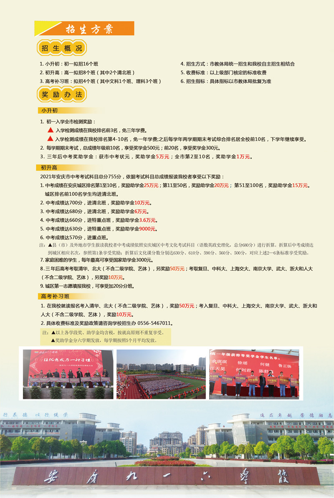
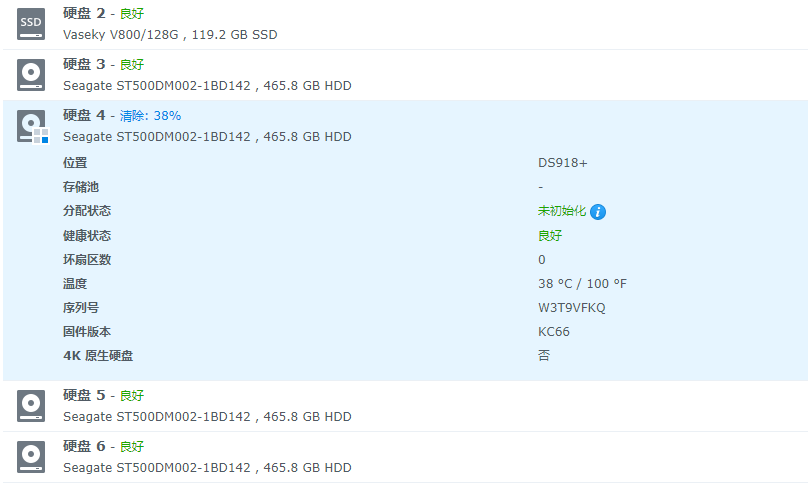

# 07月

## 1号

最近身体不适，失眠严重，是太累了吗？

AI编程已经实现了吗？ [https://copilot.github.com/](https://copilot.github.com/)

在vs中可以用了：[https://marketplace.visualstudio.com/items?itemName=GitHub.copilot](https://marketplace.visualstudio.com/items?itemName=GitHub.copilot)

fedora安装电报之前要引入安装源吗？

```text
    sudo flatpak remote-add --if-not-exists flathub https://flathub.org/repo/flathub.flatpakrepo
```

反正我是执行这个后就可以打开电报官网下载的安装包进行安装了。

扫雷有的时候是不是无解呢？比如下面这个：


下午发现电脑自动升级到了win11，蛮漂亮的，使用vs,github,双屏软件，挖矿什么的也没什么兼容问题。

注册了[cpu-z的论坛](https://forum.canardpc.com/index.php)，这个软件是法国人写的吗？居然是法语的论坛，而且也在同时使用discord，蛮有意思的。

自己就像仓鼠一样，收集了很多没用的电子设备，要这些东西有什么用呢？技术还是一样提高不了多少，增加的经验也不是什么有价值的东西。好累，还浪费了不少的金钱！

比如现在我常用的就有2个台式电脑「一个独立显卡，一个DELL微机」，2个笔记本电脑「一个acer15，一个GPD pocket」，2个手机「一个mix3，一个iphone12mini\]，2个平板\[一个ipad2018，一个mipad 4」，家中网络还有2个软路由\[一个4415的，一个ginet」，2个无线路由「一个小米r3p，一个ZTE电信的」，2个NAS「一个组装黑群dsm5，一个蜗牛自带黑群dsm6」，我每天都带着2张手机卡「一张中国电信，一张香港移动」。

这样的复杂操作只为了上网能随时看油管？！有意思吗？

## 2号

导航条的更新似乎有点问题，昨天就重新设置了，到今天还没有更新过来。是哪个地方的缓存出问题了吗？在写一些内容后就重新发布了，看来gitbook的设置是要在下一次发布时才更新的。

今天又是大雨天，阳台的问题严重了，装修时省的2000块成了非常槽心的事情，装修太相信这个所谓的熟人了，真是不应该呀。

AI编程的工具不知道为什么一直没有效果呢。是不是对md不支持呀？

看到一个非常全面而优秀的服务器相关网站：[https://www.server-world.info/en/](https://www.server-world.info/en/) 这是一个日本的网站，内容非常详实。

然后整理了一下自己的油管频道，发现自己其实在油管上是实名发布的，如果用点心很容易就可以找到本人。好吧，以后还是要注意点网络安全了。

在油管又看到一个有趣的软件：[https://www.ibik.ru/](https://www.ibik.ru/) 俄国人开发的，IT这块真是人家走的太快了。

## 3号

vs code的界面原来是在windows-&gt;zoom level中设置的，我的主机不知道为什么默认居然是-2的，，怪不得一直那么小的字。

## 4号

今天通过[https://education.github.community/](https://education.github.community/) 的教育社区认证了，简单多了，上传个照片就行了，国内的狗屁认证总是想着法子让人交钱。

[https://web.archive.org/web/20161201231738/http://ghtxx.cn/shower/?action-blog](https://web.archive.org/web/20161201231738/http://ghtxx.cn/shower/?action-blog) 可惜这个站点由于要用php5.2，我没法恢复出来，技术不行，在fedora上安装php5.2多次都是失败了，我也不想再尝试了，有些东西消失就消失了吧，互联网虽然有记忆，可人总要忘记过去的。

## 5号

高速节点的流量总算是恢复了，不过10个小时就用掉了1G的流量，看来全局上网的流量消耗很大呀。在这可以看到[3天的流量记录](https://v2free.org/user/trafficlog)。

注册了一个数字货币的收账平台：[https://merchants.mugglepay.com/user/register?ref=MPRM5](https://merchants.mugglepay.com/user/register?ref=MPRM5)

现在看来数字货币必然会成为主流了吧。

## 6号

上午填写工作档案，下午上交妈妈的材料。今天本应该带宝宝打疫苗的，然而却没有时间了。无聊的生活。

## 7号

又在Epic上领了两个免费游戏，这平台真是太牛了：[https://www.epicgames.com/store/zh-CN/free-games](https://www.epicgames.com/store/zh-CN/free-games)

因为我已经把帐号跟很多常用的平台绑定了，所以今天启用了它的两步认证。安全系数应该高一些了。

不过这个平台客户端似乎在开代理后就无法登录了，不知道是不是因为我的梯子的原因。感觉还是有点麻烦呀。

今天晚上吸引我上线的原因是一个叫[Core的限时免费](https://www.epicgames.com/store/zh-CN/p/core--early-access-faq)，这东西看上去太coooool了！

gitbook的写法重新尝试了一下，原来每个目录都可以有一个readme的说明页，不写内容就会自动生成下级结构，同时可以使用summary来定制左侧导航，真的很棒。但这个功能会让自动生成的功能失效，所以我还是禁用这个了，毕竟我这个是自己记录的，没必要因为小功能放弃主功能吧。

下午突然想起主机上的hype-v不就可以恢复一个bt面板出来吗？直接用一代hype-v虚拟了个centos，快速安装了bt面板，把旧网站导入，很快就恢复成功了，我真是无语了，当时怎么就把小主机安装了一个fedora呢，自己找麻烦。

好吧，现在旧网站恢复成功了，动动手把上面的数据迁移出来就行了。

hype-v的虚机直通也解决了，自己手动创建一个新交换机就行了，不过不知道为什么创建后主机的dns出问题了，要手动设置一下dns走8.8.8.8就行了。算了，能用就行了。

centos8跟fedora的优化命令基本通用。

## 8号
有人推荐了[十种Linux](https://www.10besty.com/best-linux-distros/),那我就全下载回来试试看吧！

所有的信件都数字化了，有些人有些事也是该做个了结的时候了，所有的信准备都丢到下雨的垃圾桶中，再也不见了，用心的朋友邮票都是漂亮的，有些人写信都只是忽悠，写信真的容易见人品呀，可惜当时并不太懂。

折腾一下午，从众多的linux中最后选择了opensuse，因为这个没怎么用过，感觉很漂亮呢，不知道是不是kde的原因，很好看的，内存占用比xfce要高的多，跟gnome差不多了，基本的操作都是占用内存2G以上的。

opensuse的安装软件命令又不一样了，比如安装git要这样：

        zypper in git-core

搞不懂各家linux为什么要把这个功能搞的各种各样的。。。

然后，中文的设置方式也有点不一样，要在 Yast 的 Language 配置中将中文加入，可以把简体中文（Simplified Chinese）选择为第二语言（Secondary Language），确认之后，系统会自动下载语言相关的组件和字体，注销当前登录之后生效。不过我还是把中文设成主语言了。相应的其他功能都会自动到位，比如liboffice的中文界面，输入法什么的都很快安装好了。感觉opensuse的支持很全面呀，还能使用nvdia的显卡：https://en.opensuse.org/SDB:NVIDIA_drivers 不过我的电脑是集显的，就不测试这个了。

不过opensuse的版本非常多，初入门会有点晕，不过免费个人用户直接用Leap版本就好了，官方文档在这：https://doc.opensuse.org/ 有[中文版](https://doc.opensuse.org/zh-CN/)

各版本的发行状况都是公开的：https://build.opensuse.org/monitor 非常赞呀！

## 9号
opensuse官方源国内访问有问题，只好换成了科大的源：

        https://mirrors.ustc.edu.cn/opensuse/tumbleweed/repo/oss/

下载github上的库又花了一个小时，新系统上线总是要睡不好的。晚安了，2点了。

手机上的servercat居然要$9.99呢，然而家中的opensuse的ssh在升级后已经搞坏了，修复试试看吧，repo也搞的很乱了。

到底要不要再把opensuse再重装一次呢？好烦人呀。ssh连的上登不上真是让人抓狂呀！！！

ssh还有一个快速同步登录密钥的命令：

    ssh-copy-id user@host

居然一直不知道用，都是手动写authorized_keys的笨办法，真是笨死了。

总算找到真正可用的ATOM汉化功能包了：[atom-simplified-chinese-menu](https://github.com/chinakids/atom-simplified-chinese-menu)

## 10号
发现自己这么多年白混了，本地优秀高中一个人不认识，之前的那些领导更多只是在忽悠我，有什么意思呢？现在连同学问高中的情况都是一问三不知。

发现维基百科真是个好东西，可惜我们访问困难，今天在股票软件中找了半天的REDHAT红帽资料，然而这个开源头马已经被IBM收购了呀！

      红帽公司Red Hat, Inc.(NYSE:RHT)创立于1993年3月，前身是Red Hat Software, Inc.，于1999年6月改为现用名，总部位于美国北卡罗来纳州Raleigh，全职雇员10,500人，是全球最大Linux系统厂商，因推出的Linux系统与软件整合套件Red Hat Linux适时响应了市场的需求，从而奠定了Red Hat在Linux业界的旗手地位。

      2019年7月9日，IBM完成以340亿美元收购红帽公司的交易，后者公司退市。开源企业软件制造商Red Hat将并入IBM的混合云部门，而红帽的首席执行官吉姆·怀特赫斯特（Jim Whitehurst）将加入IBM的高管团队，向IBM的首席执行官罗睿兰（Ginni Rometty）汇报工作。

      Red Hat Inc (红帽公司)提供开放资源软体解决方案，其软体主要为客户提供高效能、可扩充、灵活、可靠、安全及稳定的技术，以满足企业所需的IT基础建设。红帽公司产品包括Red Hat Enterprise Linux(红帽企业级Linux)、Red Hat JBoss Middleware(红帽JBoss中介软体)、Red Hat Enterprise Virtualization(红帽企业级虚拟化)及Red Hat Storage Server(红帽储存伺服器) 。

      红帽公司营运部门以地域分为美洲(美国、加拿大与拉丁美洲)、EMEA(欧洲、中东与非洲)、及亚太地区三个部门。红帽产品涉及5大技术领域：云计算、存储、虚拟化、中间件、操作系统。

浪费我许多时间，，，话说IBM还真是大神级的企业呀。

[916中学的2021年高中招生政策](http://www.aq916.net/view.php?id=2952)：



## 11号
妈的，清早洗衣也不看一下口袋，昨天刚买的一包烟就丢在洗衣机里洗成一团渣了，关键还把出水口搞堵了，这什么蠢货女人呀。

这房子搞的水电网都是渣，狗日的东西。

80块钱买一张贺卡一样的幼儿园毕业照片，真会坑钱。

## 12号
门罗币：https://agoradesk.com/buy-bitcoin-with-sgd-in-singapore?rc=w9vv [介绍看这个](https://localmonero.co/how-to-sell-monero)

白帽黑客：https://hackerone.com/hacktivity

另一套TOR类似的网络：https://zh.wikipedia.org/wiki/I2P 安装似乎简单一些，看[教程](https://i2pman.com/quick_start/install.html)

香港银行帐户不知道还能不能用了，这个71的指南可以参考，国内直接访问：https://www.yuque.com/catmanclub/kb/brhpf4

疫情对世界与中国的影响太大了，比如这个公开信：https://virginiecourtier.wordpress.com/e-mail-to-zls/

感觉现在翻墙的人越来越多了，成本虽然有，但也更草木皆兵了：https://2047.name/t/9458 这个网站跟[另一个的程序]（https://pincong.rocks/） 很相似，但不知道为什么似乎是[敌对关系](https://2047.name/t/9402)。

好了，今天把手机上看到的一些有趣的网站都整理到电脑上来了，所有电脑也都安装了电报，放弃微信要从我做起。

## 13号
所有电脑系统基本固定下来了，花了1000多买了屏幕灯和内存条，不要再折腾系统了。

## 14号
小米的物流很不错，第二天就到货了。安装屏幕灯时发现太老的1912wb显示器已经被淘汰了。无法安装，或许也是该换个显示器了吧。

https://github.com/github/copilot-preview 之前申请的这个智能AI编程工具通过申请了，可以在VS中[下载使用](https://marketplace.visualstudio.com/items?itemName=GitHub.copilot)了。

最近睡眠真成问题，3点醒，敲键盘到5:30，7：00又被女儿上学吵醒，然后接着又睡到9：30，生物钟几乎全乱了。

下午收到了8G的内存条，安装到小DELL中，opensuse立刻变的流畅起来了，内存对计算机性能的影响真是太大了。

宝宝吃了2根冰激凌，晚上有点咳嗽了。

## 15号
智能编程的copilot插件虽然安装成功了，却还是不会使用。[官方的说明](https://github.com/github/copilot-preview/blob/main/docs/gettingstarted.md)在这

粘贴的体温计没电了，查了一下购买记录，18的8月买的，也是差不多到期了。169再买一个吧。

宝宝早晨起床的时候发现身体很烫，可是体温计量的温度也只有36.7~37.2之间，并不像发烧的样子，还是请假一天，让宝宝在家休息一下吧。

垃圾的中通快递又把东西没有按时送过来，这些垃圾快递怎么还不倒闭？！

看到一种gitbook集成评论的办法，实际是两种，一个是墙外的，一个是用github自己的，都要做一些配置：https://segmentfault.com/a/1190000018777424

## 16号
起床就因为打不打疫苗而争吵，有种绝望而不是失望的感觉了。三观不合的人在一起真是痛苦。

下午发现蜗牛黑群的硬盘报错了，不知道是不是因为最近温度太高还长期开着的原因，也有可能是蜗牛机器的质量真不行吧。找块旧硬盘换了上去，要尽快把资料迁移到组装的黑群机器上了！

报错的显示是存储池变成了"堪用"，然后在管理界面中直接少了一块硬盘。

换上的硬盘会被识别出来，但是未初始化的状态。选择安全擦除，速度非常慢。应该之后可以加入存储池进行修复吧。



## 17号
又是大雨天气。群晖自动修复了堪用的存储池，果然换个硬盘就行了，NAS值得依赖呀！不过还是把蜗牛关机了，天气太热了，不值得长期开着用，毕竟还有一个黑群晖是可用的。

今天居然从推特上才知道NOI的竞赛环境更新了，然后到官网一看才知道自己今年忘记报名参加线上同步赛了，**这个玩意儿比赛结束后就没有了，不过比赛的时间还是在明年的，所以没有报名。** 这句话是AI编程工具自动生成的，很有趣吧。

这里有一组26个NOI官网发布的培训视频：https://www.noi.cn/xw/2020-05-13/715542.shtml

才知道NOI有发布官方的大纲：https://www.noi.cn/xw/2021-04-02/724387.shtml

心情不好真的很影响工作的发展，希望能成功离开这个垃圾坑吧。

## 18号
noilinux安装好了，做一些优化的记录。安徽省的noi比赛成绩看上去并不怎么样，安庆更是连省队一个名额都没有，这一块真的是没想到。

智能工具真的太牛了。

如果写博客都用智能AI会怎么样呢？其实现在我就是在写这个记录的时候不断调用AI的，它总能自动判断出我要记录的一些命令，但还并不能直接判断我的所思所想。

下午到老领导家坐了2个小时，心情也变的好了很多，两样当领导，水平差距真的太大了吧。

## 19号
Dell安装的opensuse在更新后崩溃，无法启动。懒得再折腾了，直接装回了windwos server 2012，从淘宝花9.9买个序列号就从评估版就成了正式版，微软的东西还是成为了使用习惯不可变更的，而且看上去稳定性也很好。