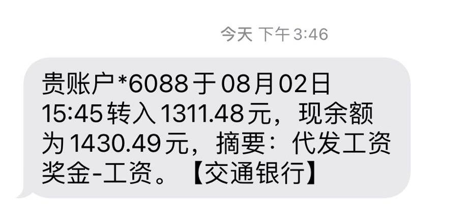

# 08月

试试会不会影响自动生成导航

## how to work with Copilot 

tell me the best write

## 1号

AI写作体验了几天后就又出现故障了。

下载了一套计算机的相关知识书，有没有时间看就是另一回事了。

查询了一下域控制的资料，其实大多数学校都应该采用域控制的方式来管理学生与教师的电脑，但这样会增加管理人员的责任与工作，所以现在更多的都还是用工作组的方式各人管理自己用的电脑，造成的问题就是设备安全无法控制。这也是360现在推广企业管理的市场所在吧。

在一个网站上看到免费主机：https://www.euserv.com/en/virtual-private-server/root-vserver/v2/vs2-free.php 
试购了一下，发现真是操作复杂，配置麻烦，跟阿里云谷歌云根本没法比，不论机器性能如何，单是从购买流程就已经完全输了。云服务的发展真的是得天独厚吧。

然后把自己用的windows 2012加了个宝宝学习用户，发现密码有复杂度要求，关闭这个不必要的限制还是要通过配置：

        gpedit.msc

计算机配置->Windows设备->安全设备->帐户策略->密码策略->禁用必须符合复杂性要求就好了。

IP6的测试站很多：http://test-ipv6.com/mirrors.html.en_US

而且还在github上开源了。

下午带宝宝到王老师家中学习一个半小时，玩了一个半小时，这丫头玩心真重呀。

晚上在虚拟机上安装了一个xp，一个win10，花9块钱就激活了，真没必要再花时间搞破解注册什么的了。再装上NOI的2.0，这个小破电脑居然比主力机还要强大了。呵呵

虚拟机真是个好东西。realvnc也真的非常专业。

## 2号
清理有道云笔记中的资料，整合onenote到notion中，跨平台的笔记才是真正有效的笔记。

继续优化虚拟机，并备份到U盘中。

还是内存限制了虚拟机的使用，当2012上的5个虚拟机一起打开后，内存占用直接满了，机器性能下降明显。

然后发现这电脑安装win2012稳定是够稳定了，没声音，没显卡加速的感觉还是不好呀。我又想买mac mini了，然而这个月的1300块钱工资让我知道这是个奢望。

继续折腾破电脑，intel 530显卡驱动在win2012中根本没法安装，进入了禁用驱动签名的模式也没法安装，太无语了，[DELL官网的530驱动](https://www.dell.com/support/home/zh-cn/drivers/driversdetails?driverid=v39n9)还不给下载，[intel的官方驱动下载](https://downloadcenter.intel.com/download/25620/Intel-Graphics-Driver-for-Windows-7-8-1-15-40-6th-Gen-)后提示操作系统版本不一致。我也是晕了。

今天查看的这个[Tim Lee博士在TED的演讲](https://www.ted.com/talks/tim_berners_lee_the_next_web)再次让我看到技术发展的层次差距之大了。[加密朋克](https://zh.wikipedia.org/wiki/%E5%8A%A0%E5%AF%86%E6%9C%8B%E5%85%8B%EF%BC%9A%E4%BA%92%E8%81%AF%E7%B6%B2%E7%9A%84%E8%87%AA%E7%94%B1%E5%92%8C%E6%9C%AA%E4%BE%86)才是真正的互联网未来吧。

折腾一番，把编程随想的博客镜像了一份下来，算是对大神的献礼吧，希望大神一切安好。

还找到了一份BT同步盘的注册码：感谢另一位[大神的分享](https://cyhour.com/1703/)

        btos1_eyJzIjogIm5xNjRmNGgrWDhxWHFiaWRodEtyTWdNcEVaMHdYaUJLbExwSWFwSDUxMzkyaHdqMFFpQWJOTTFGd2JGWGpJQ0FhV2w4V3ZidVpPenpITXZmNTRLWU1XVGVsVFZjS3JGQUpYMmVUMGttT2lCMm8zQ1BjVFd2VWlCLzRsTTlQN1FsalVSVzREMVFNUktWcEhwaG5IVzIvZmdqN05MaThmMnhNa1NDNERwRVVpQ0pXZHpPWXFIbW1OMFdOUEt6QWg4RkJoanNvUVNBa1hKN09WS0c5WElkVTczWnNlVWNxWW1WVUo0WDc0S05wYmlYZk0vemlsU2pIK0U5Y3ZMZ092YlplVjlCZXlveDNwT3pRYUJOeFNQT3FYWEpTRHE1bVRhRXMvWGppVGtJV21uVHJudVJnb01DZ0RBOHdBS3RIYjRvVkduWm1jeU8xNlhoQ3dvL2VkeHFxZz09IiwgImQiOiAiZXlKamF5STZJQ0ppZEc5ell6RmZaWGxLYW1ONVNUWkpRMHBJVlZoYVYxRldUakZsVldoWVZrWldNMUpXU2tWVVJURlZZVEZXZFZacVVsUmpNMUp5Wkcxd1FsUkVRVFZWUXpsMVZraGtUVk5wT0hsUFEzUjNUV3hrVjJOck1IaFVhelI1VXpOQ1QyUlhiR3RTYlVwb1ZtNUtURlJZVVRWVFJ6RXpWVVU1TVZwdVdtRlVWbVJ1VVd4Sk1sWXlXbkZsYm14b1ZWaHdlbEV3TVVKamJXaE5XVlYwZFZwVVJYZFRSbEpOVW5wU2JGbHBkRXBVVlRGSlYwUnNWMkV5ZEZSalZFRXdUbTVuTUdKck1WZE5SR2N3VmxWYVRsSnJNVzlqUlVwMFlVUlNlRTFJYkZaWmExRXhVbTFzTUUxSVpIZE5iR3hVWWxob1IyTkVSbE5sVlhkeVVsWm9OV0ZGUlROUmJWSnVWVEZDYUdKSVZrWkxNV3hZVmpGb2FtSjVPVWxSVlRsT1ltMTNNbE5zUlRCYWFsSlFWbXBCZUZRd1VrSlpha1Z5V20wMWRVNXVXblZSTTJnell6RldTazlGTVU1aFNHeFFUREE1TUZOc2JFWldTRkpXVlVaSk1sUkRkRkpXUjJoUlYwUlNjbGxyTlhGTlJHeFpXbmwwYjJGVk1VeFZWMVpVU3pCd2RFNTZVblpUYW14SVpEQnJlVkZ0TVVsalJGWXdWRlZTZEZreWVIcE9WbWhLV1Zkb1MxZEdSa1pqTUhSMVVsaFdlbE13VGpSaVJsSjVUVmR3ZFdOSGFFNWFlbFV3WW0xNGJFOVVhRzlUU0VWeVVWaE5NV1ZZVWxSTlIyTTVVRk5KYzBsRFNtcGFRMGsyU1VOS2JHVlZjSGRaYlRGaFpHdHNjV0l5Wkd4bFZYQTJXa2N4VDFKSFNYbFZiWGhLWVcwNWJsTlhOVTlPVjBwMFZHeEdhbUpVYUhCVVJVNUNZVlpyZVdSSVFtRlJNR3N5VTFWT1MyVkdWblJXVkVKVFltczFjbGt3V2s1TmJVVjNaVVYwYW1Wc1NsaFpla0pyVFVaRmVGRnRlRmRUUlRWNVUxZHNNMW93YkhSV2FsSnFVVEJyTWxOVlVrcGxSVFZGVmxSV1RsWkdhekJVVlZKQ1l6QnNSRk50Y0dwTk1VWndWREpzUW1GWFNqVk5WelZQVmtaYVVGbDZRbTloYkZwelZsZHNUVkV3Um5CYVJXaHpaREZ3VkZOVVdrcFJNSEF6VjJ4b1MyVnRTWGxPVjJocFVUQnNlbE5WVGt0a2JVNUpWVzV3U21GdE9XNWFXR3hMWWxkSmVXVkhkR0ZYUlhCVlYyeGtUMlZXY0ZsVlYyeFFZVlZHY0ZSdGMzaFVNVlpIVjJ4YVZGSkhVa05VV0hCVFYyeEdWbFZVUmxoU1ZGWkhWV3RXVTFWV1VrWk9WVnBYVFZWd1UxUlhjRk5VVmxsNFdqSnNUVkV3Um5CWmVrcFhZVWRTU1ZSWGJGQmhWVVkwV214bmQyTXdiRVJUYlhoc1UwVkdjRlF5YkVKbFZURlZWVlJHVUZaRlZYbFVNRkpDWkRKYVVsQlVNR2xtVVQwOUlpd2dJbWx1Wm04aU9pQjdJbTl5WkdWeVNXUWlPaUFpWVc1aGRXeG1ZVzUxYTJadWIydHViVzF6TURZNWNXbzNOQ0lzSUNKaGNpSTZJREFzSUNKbGVIQWlPaUF5TVRRMU9URTJPREF3TENBaVkzSmxJam9nTVRRNE1UUXlOek00Tnl3Z0luTjJZMGxrSWpvZ0luTjVibU5RY204eElpd2dJbU56ZENJNklDSnZMV2MxTlU1elNHTldWU0lzSUNKemRtTkRiMlJsSWpvZ0luTjVibU5RY204aUxDQWlZMmxrSWpvZ0ltZHFaV295YmlJc0lDSjBlWEJsSWpvZ0luQmxjbk52Ym1Gc0lpd2dJbTl3ZEhNaU9pQjdJbVp2YkdSbGNsTmxZM0psZENJNklDSkJWMFJOVHpSRlUxTkJUbGhCV2xKVE1rMHlORlpCTmtkQlIxSlhWVFJRTlZZaUxDQWljMlZoZEhNaU9pQXhmWDBzSUNKbGVIQWlPaUF5TVRRMU9URTJPREF3ZlE9PSJ9

## 3号
给老娘买了3成自费的药，然后做了高德开发平台的实名认证，国内基本所有平台都要实名了，这也意味着我的gamil已经是实名的了。

https://www.npmjs.com/ 也按要求开启了两步认证。

删除了手机上的airmore，这软件太恐怖了，几乎可以控制iphone所有的内容，而且还不能删除上传的信息。打算[向苹果商店投诉](https://www.google.com.hk/search?q=app+store%E6%8A%95%E8%AF%89&oq=app+store%E6%8A%95%E8%AF%89&aqs=chrome..69i57j0i512j69i64.7982j0j4&sourceid=chrome&ie=UTF-8)也找不到地方，算是眼瞎而且用iphone太少不熟练的代价吧，其实向iphone上传文件走icloud是一件很简单的事情。

## 4号

一番折腾才搞明白BT同步盘的使用方法，在用密钥同步别人分享的资料时要设置一个新目录进行接收，并不能直接在原有的接收目录继续接收的，每个密钥都是要对应一个目录才行的。然后就是在科学上网的家中并没有连接问题，但网上的大神说BT同步盘功能其实在国内已经是被墙的了。

然后就是我的蜗牛NAS能使用，但由于CPU性能太差，启动后要较长时间才有反应，包括接收密钥后也要等几秒才会生效。所以在使用时还是不能着急呀。

有钱的朋友还是买个正版的吧，一年60美元而已，支持一下这种优秀的分享软件。昨天分享的注册码在使用中好像是有问题的，今天重开机后发现注册机制提示有错误，原因不明，我只好申请了14天的免费试用，差不多14天也够下载完所有电子书了。

宝宝凌晨2点突然吐了，也不知道是不是因为昨天上一天课，又学一个半小时围棋，再学一个半小时拼音造成太疲劳的原因，唉，希望只是如此吧，身体真的要多多养一养练一练才行呀。

早上送到学校没半小时就又送回来了，到幼儿园吐了几次，接回家看了一天动画片。

然后看到一个内网的监控警报：

只是用老婆的电脑看了一下github和nicemind的网站，就被他们省公司网监发这么个通告到市公司，可见现在的内卷有多严重了。

然而，这破事提醒了我，电脑中的所有国产软件都不可信，如果需要，就算我在科学上网，他们也知道我在看什么，所以今天一天都在整理家里的电脑，把所有的国产软件，比如微信QQ旺旺什么的全都从电脑中删除了，所有的国产软件分门别类的放到虚拟机中安装使用！

在这个过程中发现淘宝上可重装的win10key真不错，直接支持vm的虚拟机克隆之后保持激活。才15块钱而已，虽然有点对不起微软，不过实在没办法，毕竟俺的收入有限：

真是狗屁的一天。

## 5号
累了，整一天了才把机器整理好，休息了。

幼儿园又通知停课了，真是无语了，我发现这个幼儿园不是蠢就是坏呀。然后发现是全市都通知停课，包括宝宝的围棋班也被停了。

然后宝宝说不想上拼音课了，看来写作业对她来说还是很痛苦的。

晚上还是带着她去上了拼音课，还好，也在老师那把作业写了出来。

## 6号
chrome浏览器的强制https对我来说还是有点麻烦呀，毕竟家中不可能所有服务都配置https

                chrome://net-internals/#hsts

还是安装了一个 firefox，这浏览器还是好用。开使试用家中的gitlab，然而发现一堆总是，先把Noi的key和dell的key配置了一下。然而NAS版的gitlab端口太难配置了，算了，只用http来访问这个gitlab吧，本来也就是个测试用的。

确定了，走教，这样没什么可纠结的了。最烦的是我都不知道自己是被哪边耍了。

一切不开心都是自己造成的？

mysql可以连接了，要设置所有主机可连才行。

是不是应该开放一个测试用。去年买了个表，老子不想再学什么了。

## 7号
智能编程的工具不知道为什么没效果了。

网页炸弹的小工具在firefox中已经不能使用了：http://fontbomb.ilex.ca/

今天凌晨一直整到4点，就为了记录所有的信息学比赛资料，希望宝宝将来能在这些比赛中获得成长，但现在看来宝宝在这方面似乎没有专长，兴趣点全在看动画片上了。

今天继续整理吧，9月就要开始NOI的初赛了。

发现一个插件在ff上还是比较好用的，可以快速复制到MD文档。

吃饭聊天到23点才回家，事情都是太复杂了。累人。
## 8号
孩子的事好说，自己的事难定，估计没什么好果子吧。
输200块玩一下午，还是蛮好的。

## 9号
下午继续上课，报怨教育系统的诸多弊端。

回来路上到公园玩了2个小时，跟一个老不要脸的东西吵上一架，宝宝面对老东西不要脸的谎话不会反驳让我很生气。

## 10号
拿小学的入学通知书，宝宝太害羞了。

上午写一页作业，下午睡一个小时，看动画片。

## 11号
小熊美术因为一节较难的课，让宝宝不想画了，没有迎难而上的品质是个问题。

今天大雨，带她出门学习吗？

下午发钱了，花1万买老婆开心值得吧。

红帽子的linux认证在官网这页：https://www.redhat.com/zh/services/training/locations-facilities

合肥居然还有两家，难得呀。1、安徽肯耐博网络技术有限公司 2、合肥清默网络技术有限公司。

## 12号
上午完成一节小熊美术，下午买40块钱的围棋课继续学习。

还在纠结是不是应该买一台mac mini，方便自己的苹果化生态接入呢。毕竟也要5800左右才行呀。

路由器还是先换一个吧，多卡宝的稳定性实在太差，无法承担远程手机卡的任务。只能用来接收短信使用罢了。

## 13号
买的tplink ax1800易展版到了，京东服务不错，送货上门，然后发现这破路由居然不提供美区APP，国货还是不行呀，一分钱一分货的道理我还是忘记了。只能继续使用安卓手机做控制，然而连接限制的功能又会影响隔层zte的路由接入，我要被这破网折腾死了。垃圾呀。

晚上陪兄弟开车准备到三县尖上玩玩，由于下雨，车开到了离山顶还有1英里的时候能见度只有2米了，只好调头回来，到天桥下吃盘大虾，喝2瓶啤酒，倒也蛮是舒适。毕竟都是人到中年，好多感慨，只希望大家今后都能顺顺利利吧。

## 14号
早上起床发现ZTE路由重启后又导致所有设备掉线，真是无语。

网络这么差劲怎么行呢？真的要拉一根网线吧。还是网线最稳定呀！

真想买一个mac mini呀，算了一下要6000块钱呢。

今天才知道苹果有一个教育平台：https://www.apple.com.cn/education/

遗憾是这个功能只在大陆对私立学校开放，公立学校还没有接入的机会呢。当然，这个也是个付费功能，要配合ipad来进行教学使用的，学校需要一定的财力和技术能力才有可能接入，公立学校目前还没有这个可能吧。https://support.apple.com/zh-cn/guide/schoolwork-teacher/phxe0979e998/ios

## 15号
腾讯云搞出来一个[混合云资产管理](https://cloud.tencent.com/document/product/296/12236)的功能，有点落云当年的感觉了。

然后支付宝被解开了，发现我的私房钱了，还真是不小心呀。我怎么就相信这个SB支付宝软件了呢。。。。

话说如果不是她的奇葩父母拿我们钱贴她弟弟，我又会不会存钱呢？

## 16号
交1万块买个家和吧，说来说去还是没钱的原因。

晚上送姜铭一餐，聊的还是闲话。

TPlink的路由器真的只是面对中国人的，连美区的APP都没有。

## 17号
学python也没那么容易，基本的配置都搞半天。

看到一个博客说[Intel也提供免费主机](https://51.ruyo.net/17346.html)，试了一下：https://notebooks.edge.devcloud.intel.com/hub/login [intel这个在线资源](https://software.intel.com/content/www/us/en/develop/tools/devcloud/edge/overview.html)内容也超出了我目前的学习能力，只能保存观看了。

看邮件说明好像只能试用4个月，然后要重新申请的。主要是面向未来的一种边缘计算应用，intel果然牛，提供的是超级计算机的资源呀。

## 18号
启用一个域名专用记录后续的教学工作，不要再把工作与生活混在一起了。 

https://if.aqde.net

同时发现gitbook增加了一个功能：https://app.intercom.com

本来打算用家中的gitlab做一个同步备份的，然而由于是在nas上开的docker，导致ssh在这个上面没法用，只好做罢，留此文记录做以后参考：[如何同时向两个远程仓库同步git](https://segmentfault.com/a/1190000022199425)

整理新的比赛内容。

## 19号
发现gitbook对github的新分支名称main很不友好呀，哈哈，我还是把资料拿回这边来写吧，不折腾了。

有点累了。https://app.intercom.com/a/apps/qeg4ijii/users/segments/active 这个功能不太看的懂呀。原来是一个收费的网页聊天工具。。。

找到主力机的主板说明书了：https://www.asus.com.cn/Motherboards-Components/Motherboards/PRIME/PRIME-B365-PLUS/

还是没忍住，168买了个主机管理的windows软件：[FinalShell](http://www.hostbuf.com/t/1081.html)

## 20号
买了一个512的M2固态盘，打游戏速度果然快了不少。还好，价格368，京东速度就是快，服务就是好，第二天就送货上门来了。

想起来一个好网站，https://bitly.com  只是国内用不了。